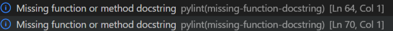

# ***My Thrid Project***

# **Title**
### Sunken Ship!
***

## **Live Site**
***
[Sunken Ship](https://sunken-ship.herokuapp.com/)

## **Repository**
***
[https://github.com/DSP1994/Sunken-Ship](https://github.com/DSP1994/Sunken-Ship)

## **Table Of Contents**
- [Ojectives](#objective)
- [How To Play](#how-to-play)
- [Features](#features)
    - [Title/Message To Player](#titleenter-player-name)
    - [Hint/Displaying Game](#hintdisplaying-game)
    - [Guessing A Letter](#guessing-a-letter)
    - [Guessing A Number](#guessing-a-number)
    - [Guessing Multiple Letters At Once](#guessing-multiple-letters-at-once)
    - [What Happens If You Loose?](#what-happens-if-you-loose)
    - [Once You Win!](#once-you-win)
- [Future Features](#future-features)
- [Frame Works, Deployment, Libraries](#frame-works-deployment-libraries)
- [Testing](#testing)
- [Accessibility](#accessibility)
- [Issues And Bugs](#isses-and-bugs)
- [Validator Testing](#validator-testing)
- [Delployment](#deployment)
- [Credits](#credits)
- [Special Thanks](#special-thanks)
***
## **Objective**
This is a very simple rendition of hangman. The aim of the game is to not let your ship sink, rather than your man hang!
***
## **How To Play**
Once you have entered your name, you will have 6 failed attempts to guess the word on the screen. By playing one letter at a time. No numbers will be permitted within the game. This is covered within the [Features](#guessing-a-number) section of the ReadMe.md file.
***
## **Features** 
### Title/Enter Player Name
Upon loading the game, you are greeted with the title of the game, as well as a feature to enter your player name.

### Hint/Displaying Game
Once you have entered your player name, a hint to the words within the game will appear. Along with your magnificant ship!

### Guessing A Letter
Upon playing the game, you will have to start guessing letters. One of two things will happen. If you get the letter right, it will appear within the blank spaces;

If you get it wrong, then the incorrect letters will appear above where you are guessing as a reminder you have already guessed it.

Along with this, if you mistakenly press the same letter again, a message will appear reminding you that you have already tried this, and to guess again.

### Guessing A Number
No numbers should be in this game, so if you were to enter any number, then a message will appear to inform you to try again.

### Guessing Multiple Letters At Once
This is a one letter at a time game, it is unable to take full word guesses currently, so if you enter multiple letters you will be informed to try again.

### What happens If You Loose!
Loosing is a part of life unfortunately! However, you will be given a do over if you wish to try again! after your six guesses, and your ship has sunk to the bottom of the ocean, by typing in 'yes' or 'y', it resurfaces and you get to go again!

### Once You Win!
Congratulates! You beat the odds! You'll be able to try the game again, or simply typing 'no' or 'n' into the terminal will cancel the game, and you will have to press 'run programme' in order to restart it.

***
## Future Features
> One of the primary functions I would look at adding into the game in the future, would be the ability to guess the word entirely once you have accumulated enough letters to take a guess at the secret word.
> I would also look into adding a 'get another hint' function, from which a player could click if they were on their last life, to receive a unique one time hint on the word they are trying to guess.
***

## **Technology Used**
- [Python](https://www.python.org/)
***

## **Frame Works, Deployment, Libraries**
- [GitHub](https://github.com/)
- [Gitpod](https://www.gitpod.io/)
***

## **Testing** 
- The majority of my testing was done as I was writing the code, and flicking through the 'problems' section of the terminal within gitpod.
- Once my program was deployed I used the Heroku app function to input correct and incorrect data to ensure I was recieving the outcome I expected/wanted.
- Since deploying the code/program, I have asked some friends and family members to try the game and inform me of any bugs or bad user experiences and here is what they've had to say;
    - 'I like the look of the ship sinking. It looks really simple with the keyboard design but also very creative. I like the details of the hints and and personalized commands. Like writing your name, and getting feedback when you type something wrong, or guess the same letter twice.'
    - 'It took me a second to figure out it was a rendition of hangman! But it was very easy to pick up, and the ship looks cool!'
    - 'I thought this was really well made and really easy to use! I tried on my phone and computer, and found that unfortunately on my phone, it was a little hard to use, but worked great on my computer!'
***

## **Accessibility**
- No images have been used on the site.
- No colours or CSS has been used to modify the app.
***

## **Issues And Bugs**
#### **Problems Within Gitpod**
- Unfortunately there are a number of problems within the gitpod terminal, including the following;
    - Under-indented for visual indent

    
    - Invalid escape sequence

    
    - Trailing Whitespace

    
    - Missing function or method docstring

    

- Working through this methodically;
    - The code runs perfectly fine without the indents, however I believe that this is more for the coders experience, rather than affecting the user.
    - The odd backslashes '\' is due to the keyboard design of the sinking ship, unfortunately there is not much I can do about this error.
    - Trailing whitespaces were easy enough to fix, I headed over to each line and removed the aforementioned 'whitespace'.
    - Unfortunately for this issue, I was unable to fix it. If I copied my code from one run.py to another it seemed to fix the issue, however, when removing the old run.py file, this problem would return. Very odd issue, that google could not help with unfortunately!
***

## **Validator Testing**
- I ran my code through [PEP8](http://pep8online.com/), which is a python code checker. No errors were found.

***

## **Deployment**
***
For deployment, I followed the steps below which have been provided by the Code Institute.

In HEROKU after creating the account:

1. "Create new App"

2. Give the App a unique name and enter region

3. Click on "Create App"

4. Click on "Settings" on your new App Dashboard

5. Scoll down to Config Vars where in my instance I only inserted KEY: PORT and VALUE: 8000 since I have no creds.json files to add.

6. Press Add-button

7. Scroll down to Buildpacks and press the icon for Python, click Save Changes, then press the icon for Nodejs and save changes. These Buildpacks need to be in below order:
                - Python NodeJS

8. Go to Deploy section tab and scroll down to Deployment Method. I connected to my Github pages and could thereafter search for my Github Repository "Sunken-Ship" and then click connect.

9. Scroll down to Automatic and Manual Deploys sections. I clicked on Automatic Deployment so that my changes that I push to github automatically updates in Heroku.

10. Then in the Manual Deploy section, press Deploy Branch.

11. After project has been deployed successfully I clicked the View-button to see the program run in the terminal.

## **Credits**
In order to complete this project, and to find ways to improve myself, I used the following sources;
- Invent with Python.
- Kylie Ying on YouTube for a tutorial on Hangman (which I later adapted to my own rendition).
- Tech With Mike who is also on YouTube for further help.
- Along with Programming With Mosh for hint and tips.
***

## **Special Thanks**
To my mentor Spencer Barriball for is incredible assistance on this project!
***
